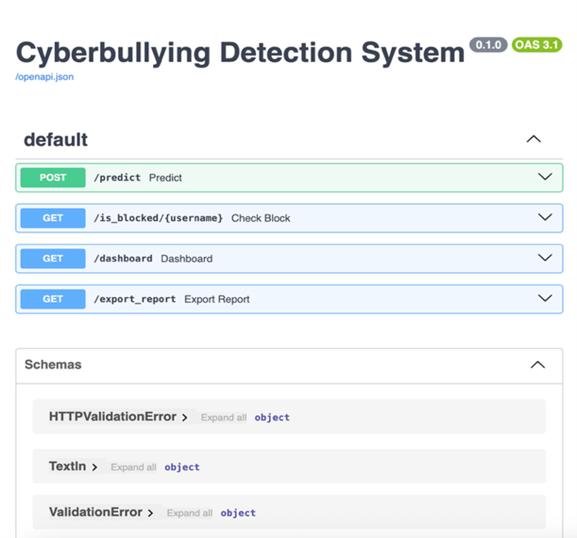
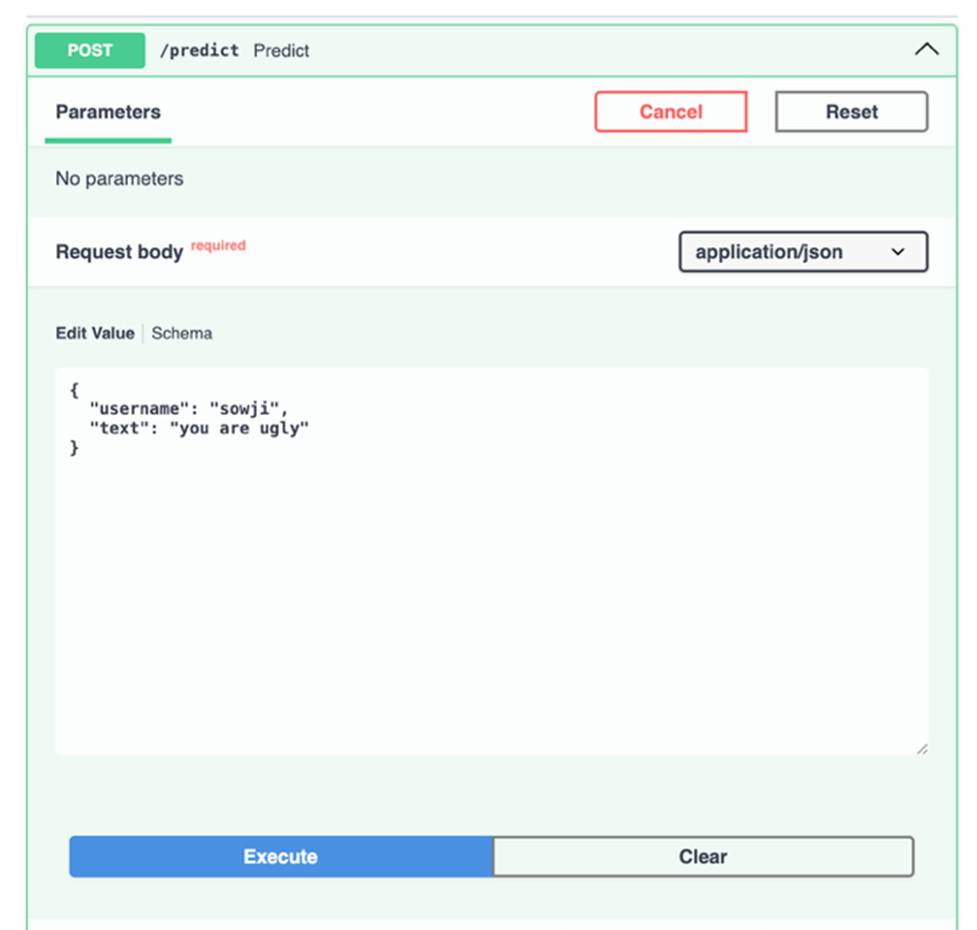
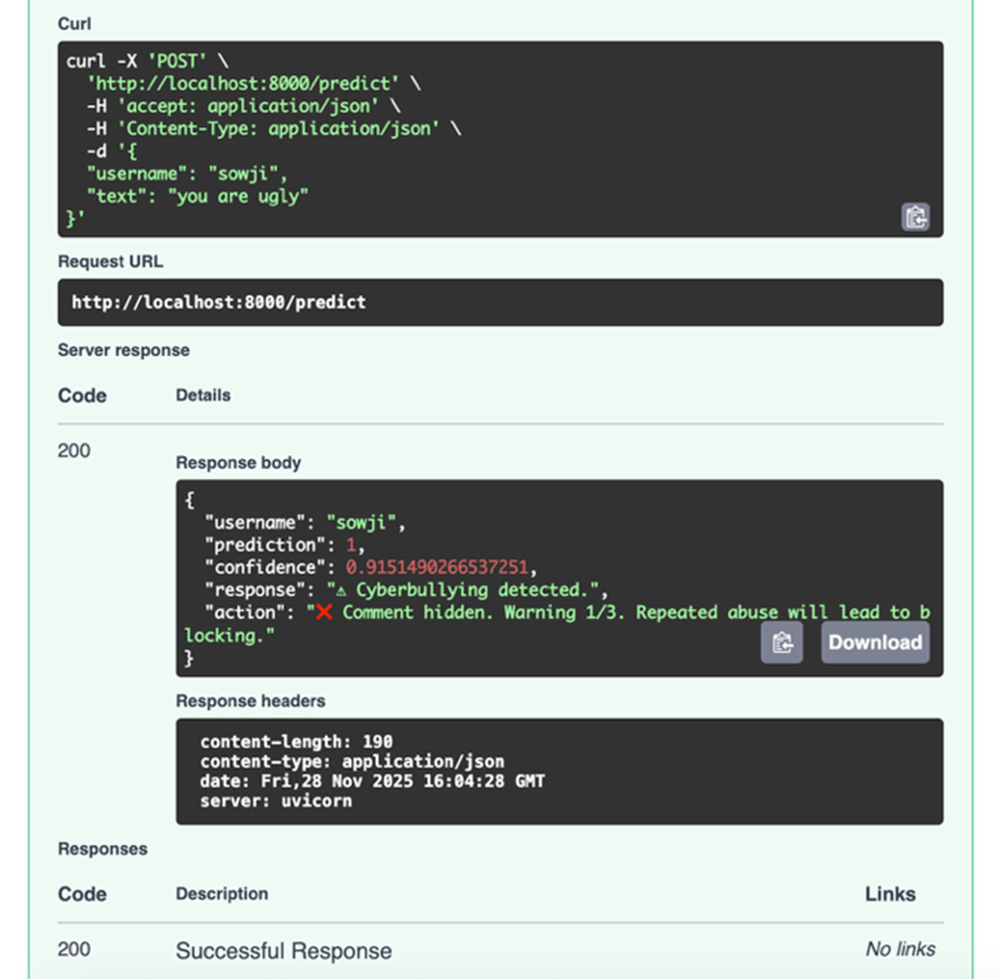
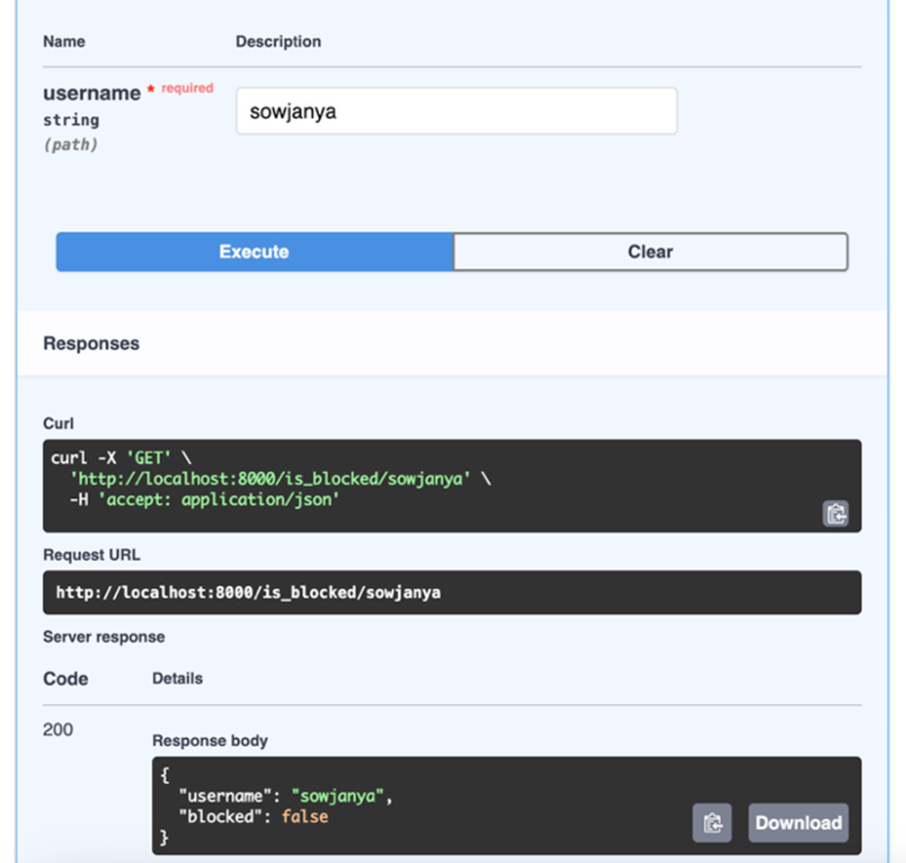
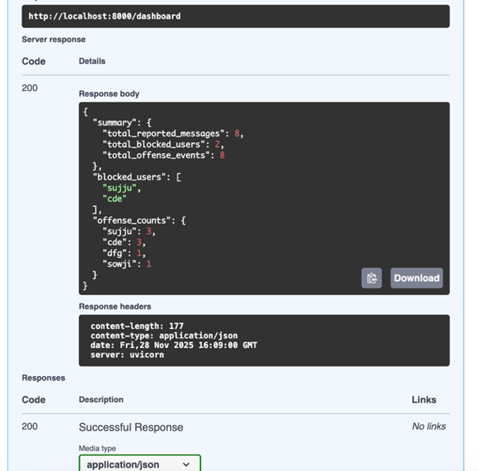
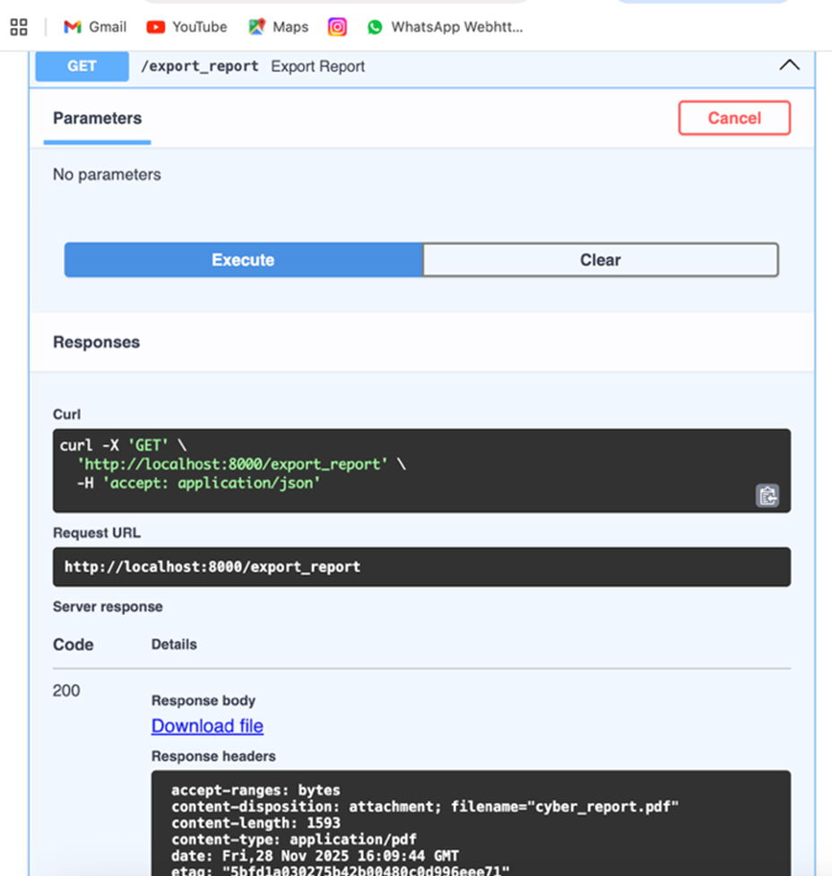

# 🛡️ Cyber Bullying Detection System

A Machine Learning–based system to detect cyberbullying content from user text.  
This project helps identify harmful or abusive language using NLP techniques and classification models.

---

## 📌 Project Overview

Cyberbullying is a growing problem on social media and online platforms.  
This system analyzes user input text and classifies it as **Bullying** or **Non-Bullying** using Machine Learning.

The project demonstrates:
- Natural Language Processing (NLP)
- Machine Learning model training & prediction
- REST API–based prediction system
- Clean project structure suitable for real-world applications

---

## 🧠 Technologies Used

- Python  
- Flask  
- Scikit-learn  
- Pandas, NumPy  
- TF-IDF Vectorizer  
- Machine Learning (Logistic Regression)  

---

## 📂 Project Structure
cyber_bullying_detection/
│
├── api/ # Flask API files
├── src/ # Model training & preprocessing scripts
├── models/ # Saved ML model & vectorizer
├── assets/ # Output screenshots
├── dataset/ # Training dataset
├── .gitignore
├── requirements.txt
└── README.md


## ⚙️ How the System Works

1. User provides input text
2. Text is cleaned and preprocessed
3. TF-IDF converts text into numerical features
4. Trained ML model predicts bullying or non-bullying
5. Result is returned through an API response


## 🔌 API Usage Example

### Endpoint

POST /predict

### Sample Request
```json
{
  "text": "You are stupid and useless"
}
### Sample Response
{
  "prediction": "Bullying",
  "confidence": 0.87
}

###📈 Model Performance

Algorithm: Logistic Regression
Vectorizer: TF-IDF
Accuracy: ~87%
Evaluation Metrics: Accuracy, Precision, Recall
###🖼️ Output Screenshots
## 🖼️ Output Screenshots

### Output 1 – User Input


### Output 2 – Text Preprocessing


### Output 3 – Prediction Result


### Output 4 – Bullying Detection Alert


### Output 5 – Model Evaluation


### Output 6 – System Logs


###▶️ How to Run the Project
1️⃣ Clone the Repository
git clone https://github.com/kandaroopadevi/cyber_bullying_detection.git
cd cyber_bullying_detection
2️⃣ Install Dependencies
pip install -r requirements.txt
3️⃣ Run the Application
python api/app.py

###🚀 Future Enhancements
Use deep learning models (LSTM / BERT)
Support multiple languages
Deploy on cloud platforms (AWS / Render)
Real-time social media content analysis

